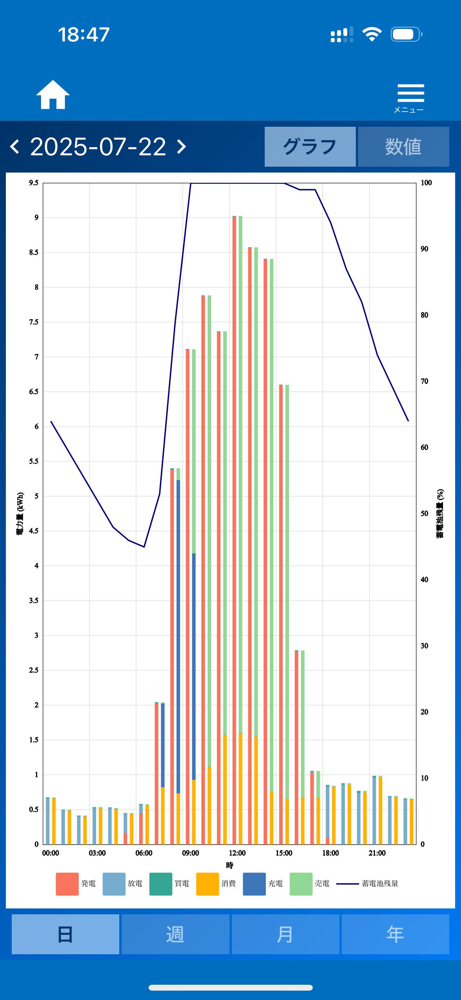
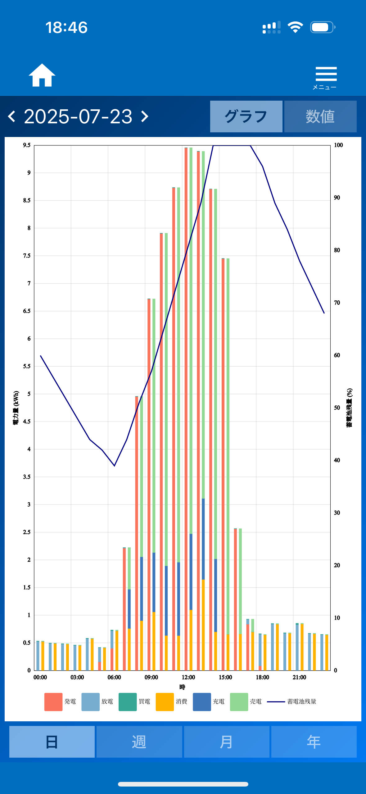
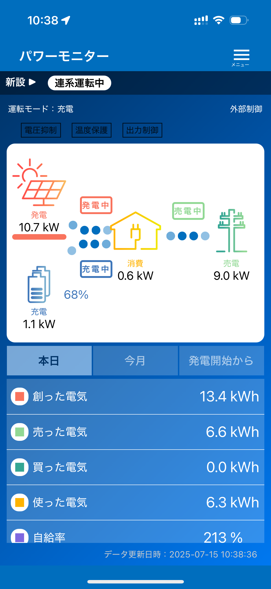

# ECHONET Lite Controller for EIBS7

EIBS7をECHONET Liteで制御する非公式ソフトウエアです。
作者が個人的に必要な機能だけ実装しています。
本ソフトウェアの使用に関連する損害に対して、作者は一切の責任を負いません。使用は自己責任でお願いします。

## 機能

EIBS7のパワーモニターアプリで設定できる「節エネ」モードの場合、次のスクリーンショットのように余剰電力を上限の5.4kWまでは全て充電に充てるため、太陽光パネルの容量や季節にもよりますが午前中の早い段階で満充電になってしまいます。
一般的にリチウムイオン蓄電池はゆっくり充電した方が劣化が少ないとされていますので、太陽光発電をしている時間帯をできるだけ長く使ってゆっくり充電した方が蓄電池の劣化が抑えられるのではないかと考えます（なお、EBIS7の蓄電池の特性もそのようになっているかどうかは不明です）。



<br>
そこで、本ソフトウェアは次のスクリーンショットのようにゆっくり充電するようEIBS7を制御する機能を提供します。



<br>
また、副次的な効果として、発電量がピークに達する正午前後においても蓄電池への充電が継続しているため、パワコンの容量9.9kWを超える電力を太陽光パネルから取り出せるようになるようです（9.9kWを超える出力が出せる大容量パネルを搭載している場合）。



## 使い方

go言語の実行環境がインストールされているコンピュータ上で実行できます。
```
$ go run main.go
```

実行バイナリを生成するには次のようにします。
```
$ go build main.go
```

次のようにすることでターゲットOSとアーキテクチャを指定してビルドすることもできます。
```
$ GOOS=linux GOARCH=amd64 go build main.go
```

## 設定
`config.toml` ファイルで設定できます。
設定可能な項目は `config.toml` 内のコメントと [docs/README.md](docs/README.md) をご覧ください。

## 補足
本ソフトウェアは Gemini CLI を使用して生成しました。作者はgo言語に詳しくありません。